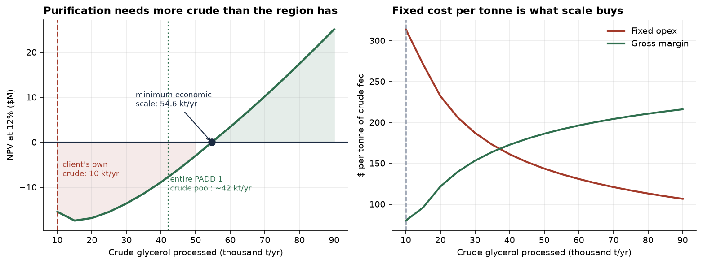
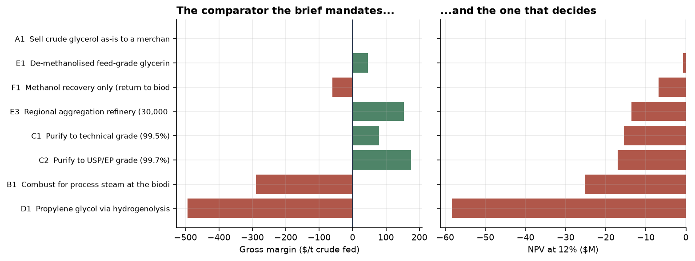
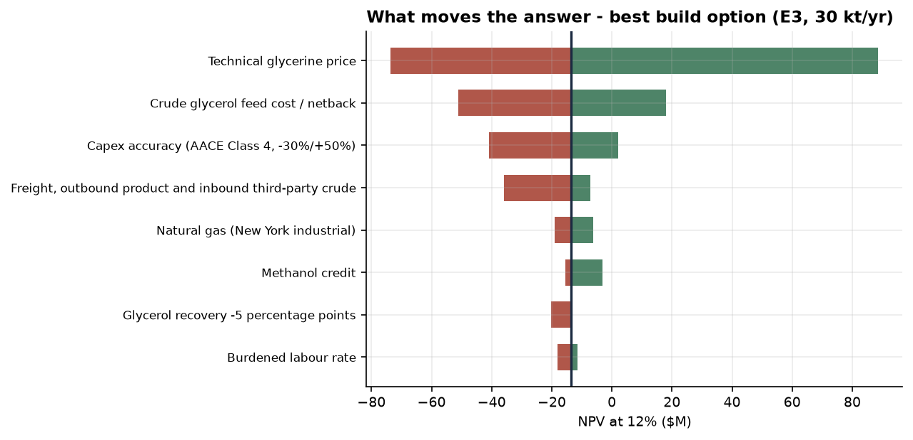
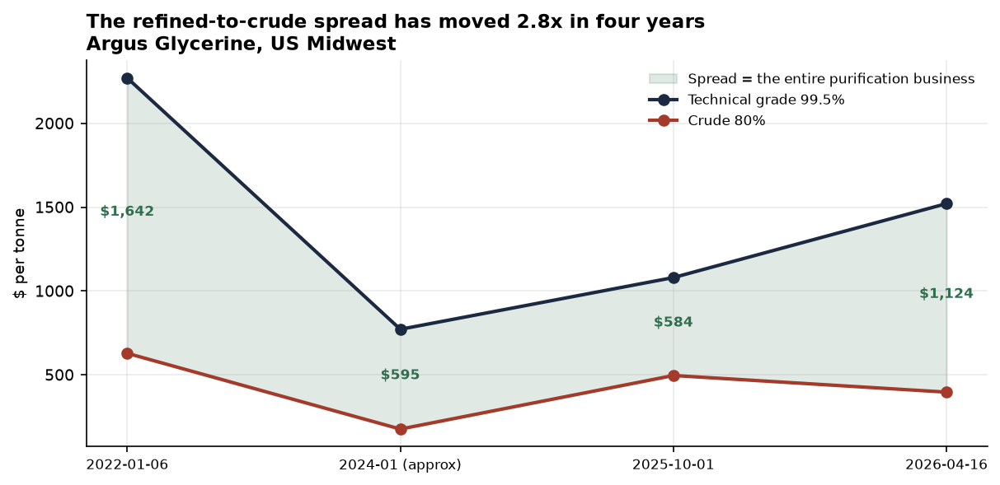

# Crude Glycerol Valorization — Stage 1 Route Recommendation

**Olin Engineering → Cayuga Renewable Fuels**
Stage 1 deliverable: feasibility screening and route recommendation
Basis date: 12 September 2026 · Capex class: AACE Class 4 (−30% / +50%) · CEPCI 870.5 (June 2026 prelim.)

Supporting model: `tea/` (Python) · Full traceable economics: `outputs/glycerol_TEA.xlsx` (16 sheets)

> **Revision note.** An earlier draft of this screen recommended building a 30,000 t/yr regional aggregation refinery on a calculated NPV of +$6.7M. That recommendation is **withdrawn**. Subsequent sourcing of prices and capital-cost bases we had carried as placeholders moved the same route to **−$13.6M**, and moved the minimum economic scale from 22,900 t/yr to **54,600 t/yr**. The four changes that did it are itemised in §2.3. The conclusion below is the opposite of the earlier draft's, and we would rather say so than quietly reissue.

---

## 1. Executive summary

**Do not build. At 10,000 t/yr of crude glycerol, every route we screened destroys value against simply selling the crude, and the recommendation is A1 — continue selling crude glycerol as-is.** The purification routes the client is most likely to be advised toward (technical grade, USP grade) are the *worst* offenders on a net-present-value basis despite ranking second and third on the gross-margin comparator the brief mandates.

**The minimum economic scale for glycerol purification on this basis is about 54,600 t/yr of crude — 5.5× what the client produces, and roughly 130% of the entire estimated PADD 1 crude glycerol pool.** Aggregating third-party crude is the right instinct and it does improve unit economics exactly as theory predicts, but it does not close the gap: a 30,000 t/yr regional refinery still returns **NPV −$13.6M at IRR 5.1%**. The scale that works is not available in the Northeast.

The one thing worth doing now is small: a **$3.5M methanol-recovery and feed-specification project (E1)**, which sits essentially on the hurdle at **NPV −$0.7M, IRR 7.8%** and turns positive on a $16/t improvement in the feed-grade premium. That premium is the single unresolved commercial number in this study, and resolving it is worth more than any further engineering.

### Headline comparison

| | **A1 — Sell crude (recommended)** | E1 — Feed grade (marginal) | C1 — Stand-alone purification | E3 — Aggregation at 30 kt/yr |
|---|---|---|---|---|
| Crude processed | 10,000 t/yr | 10,000 t/yr | 10,000 t/yr | 30,000 t/yr |
| Product | — | 9,145 t/yr feed grade | 7,249 t/yr technical 99.5% | 21,747 t/yr technical 99.5% |
| TCI | **$0** | $3.51M | $21.75M | $42.04M |
| EBITDA | $0 (by construction) | $0.47M/yr | $0.80M/yr | $4.60M/yr |
| Margin per t crude fed | $0/t | $47/t | $80/t | $153/t |
| Simple ROI | n/a | 5.1% | −2.8% | 3.2% |
| Payback | n/a | 8.5 yr | never | 10.5 yr |
| **NPV @ 12%** | **$0** | **−$0.72M** | **−$15.45M** | **−$13.59M** |
| IRR | n/a | 7.8% | −5.2% | 5.1% |

---

## 2. The central tension, quantified

The brief asks for the scale tension to be quantified rather than hand-waved. Here it is.

### 2.1 The number

**Minimum economic scale = 54,645 t/yr of crude glycerol**, the capacity at which the aggregation flowsheet reaches NPV = 0 at a 12% discount rate. The client has 10,000 t/yr — **18% of the scale required**.



The right-hand panel shows the mechanism, and it is exactly the one the brief anticipated. Gross margin per tonne of crude improves only modestly with scale, from $80/t to $216/t, because it is set mostly by the refined-to-crude price spread. Fixed operating cost per tonne falls much harder, from $314/t to $107/t. The project only becomes investable once margin clears fixed cost by enough to service the capital, and that happens far to the right of where this client sits.

Concretely, tripling throughput from 10,000 to 30,000 t/yr:

- multiplies ISBL capex by 3<sup>0.6</sup> = **1.93×** ($11.33M → $21.91M)
- multiplies operator headcount by 3<sup>0.35</sup> = **1.47×** (7.2 → 10.6 FTE)
- multiplies total fixed opex by only **1.79×** ($3.14M → $5.62M), against **3× the crude**
- cuts fixed cost per tonne of crude fed by **40%**, from $314/t to $187/t

Every one of those numbers behaves the way the textbook says it should. The route still loses $13.6M.

### 2.2 Why aggregation cannot be scaled into the money

The left-hand panel above carries a second vertical line that is the real finding: **the entire estimated PADD 1 crude glycerol pool is roughly 42,000 t/yr**, derived from EIA's count of 9 biodiesel plants with 128 MMgy of aggregate capacity at ~10 wt% glycerol yield. Minimum economic scale is 130% of that pool. To reach it the client would have to buy **every tonne of crude glycerol produced in the Northeast, and then import more**, in competition with incumbent merchant refiners who already buy it.

The cost that makes this self-limiting is inbound freight. Crude glycerine is assessed **fob**, so the buyer carries the haulage, and the further the gathering radius extends the more of it there is. At 30,000 t/yr the inbound freight bill on 20,000 t of third-party crude is **$1.60M/yr** — larger than the entire natural gas bill of the stand-alone plant. Aggregation buys scale economies with one hand and pays them back in logistics with the other.

### 2.3 What changed from the earlier draft

Four corrections, in order of impact. All four move the same way, which is itself a warning about the direction of placeholder bias.

| # | Correction | Effect on E3 @ 30 kt/yr |
|---|---|---|
| 1 | **Inbound freight on third-party crude was omitted.** Crude is assessed fob; the buyer pays haulage | −$1.60M/yr EBITDA |
| 2 | **A polishing step was missing.** No published TEA reaches 99.5% — the vacuum-distillation basis we used tops out at **96.91%**. A polishing increment is required to access the technical-grade price | +$2.75M ISBL |
| 3 | **Steam was costed as fired fuel only.** Per US DOE, total steam generation cost is fuel cost × 1.30 to cover feedwater treatment, blowdown, deaeration and makeup | −$0.87M/yr EBITDA |
| 4 | **Capex basis year re-fixed.** Attarbachi et al. state CEPCI = 532.9 (January 2010), not the 550.8 annual average we had used | +3.4% on purification capex |

Net: **−$12.2M of NPV** and a minimum economic scale that more than doubles. Sourced prices for sulphuric acid, electricity, labour and the recovered-FAME credit moved things by less than $0.3M/yr combined and are not material to the conclusion, despite sulphuric acid proving to be **4.9× our placeholder** ($875/t delivered upstate New York versus $180/t assumed).

### 2.4 Why conversion loses, in one calculation

The brief asks whether a specialty derivative's higher margin per tonne can overcome the scale penalty. For propylene glycol (D1), the most credible conversion candidate, it cannot, and the reason is structural rather than a matter of price assumptions.

Hydrogenolysis catalysts are poisoned by sodium, chloride and soaps — published tolerances run to **0.25 ppm chloride, 1.5 ppm sulphur and 2.6 mmol/kg glycerides** — so **D1 does not replace the purification plant, it sits on top of it.** The right comparison is therefore incremental against C1:

| | C1 (purify and sell) | D1 (purify, then convert) | Increment |
|---|---|---|---|
| Total revenue | $9.60M | $8.77M | **−$0.83M/yr** |
| Total capital | $21.75M | $31.12M | **+$9.38M** |

**D1 spends $9.4M of additional capital to earn $0.8M/yr *less* revenue**, before the $1.49M/yr hydrogen bill and the additional operators. Its standalone NPV is **−$58.35M**. The revenue goes *down* because hydrogenolysis converts 7,213 t/yr of refined glycerol worth $1,250/t into 4,043 t/yr of propylene glycol worth $2,000/t — mass is lost to water and to unconverted glycerol faster than value is added.

Two supporting points from the literature, both of which argue against the optimistic yields usually assumed:

- Sourced kinetics are worse than the figures typically carried in student TEAs. We used **75% conversion at 90% selectivity**, the top of the band reported in *J. Ind. Eng. Chem.* (2017) for a commercial Cu catalyst. Dasari et al. (*Appl. Catal. A*, 2005) report **54.8% conversion at 85.0% selectivity** on a 20 wt% water feed, and note selectivity *falls* above 200 °C because the PG itself is over-hydrogenolysed.
- The industrial history is discouraging. Of three majors who announced bio-PG, **only ADM built** — at 100,000 t/yr, roughly 25× this site, and after a failed first start-up. Ashland/Cargill's 65,000 t/yr joint venture was never built; Huntsman never scaled.

This generalizes. Every conversion route on the brief's list either (a) requires purified glycerol first, inheriting C1's capex before adding its own, (b) requires a co-reactant this site cannot source, or (c) targets a market too small to absorb 5,000–12,000 t/yr of new supply. Section 3 records which, now with sourced market volumes rather than assertions.

---

## 3. Pass 1 — Gate results

Twenty-two candidates screened; six survive to Pass 2.

| Code | Route | Result | Failed gate | Reason |
|---|---|---|---|---|
| **A1** | Sell crude as-is | **PASS** | — | The null hypothesis, the hurdle, and the recommendation |
| A2 | Disposal / AD offtake | FAIL | Scale fit | Value-destroying whenever the crude market is positive; retained only as the downside bound |
| **B1** | Combust for process steam | **PASS** | — | Passes every technical gate; killed on economics in Pass 2, not on feasibility |
| **C1** | Technical grade 99.5% | **PASS** | — | Mature, de-risked, CHEMCAD-tractable |
| **C2** | USP/EP grade 99.7% | **PASS** | — | As C1 plus ion exchange and a quality system |
| C3 | Membrane / ion-exchange-led | FAIL | Technical readiness | Cannot reach 99.5%, so never accesses the price tier that justifies the capex. Bansod et al. (2025) report −$2.72M/yr (membrane) and −$11.42M/yr (ion exchange) at this exact scale |
| **D1** | Propylene glycol | **FAIL** (carried) | Raw material | At ~480 kg H₂/day this site sits in DOE's sub-500 kg/day tube-trailer bracket — the highest-price tier. Carried through Pass 2 anyway so the loss is quantified rather than asserted |
| D2 | 1,3-propanediol | FAIL | CHEMCAD, readiness | Live-organism kinetics CHEMCAD handles poorly; catalytic route not commercially demonstrated outside a captive process |
| D3 | Epichlorohydrin | FAIL | Scale, raw material | **Smallest glycerol-to-ECH plant ever built is 50,000 t/yr** (Meghmani Finechem, Dahej, 2022); smallest unit any licensor offers is 30,000 t/yr. This site would make 7,300 t/yr — 15% of the smallest ever built. Both Solvay Epicerol plants were bolted onto existing chlor-alkali complexes because the route needs captive HCl (0.974 t/t ECH ≈ 7,100 t/yr here) |
| D4 | Acrolein / acrylic acid | FAIL | Safety, scale | Acrolein IDLH is 2 ppm; acrylic acid is a 6 Mt/yr commodity |
| D5 | Glycerol carbonate | FAIL | Scale fit | **Zero margin even at best case.** Buying DMC cuts capex to ~$7.4M but raises total annualised cost to ~$3,102/t against a $3,000–3,500/t price. Integrated DMC removes the reagent cost but needs $25–30M of capex. Top three producers hold 91–94% of a 65,000–150,000 t/yr market |
| D6 | Solketal | FAIL | Scale, raw material | **Best capex fit in the conversion set** ($1–3M TCI) and it still fails: the world merchant market is ~5,600 t/yr and **shrinking at −5%/yr**, while this site would make ~11,500 t/yr — about twice the entire world market |
| D7 | GTBE | FAIL | Raw material | Requires reliable isobutylene supply this site cannot obtain |
| D8 | Dihydroxyacetone | FAIL | Scale, CHEMCAD | **The most emphatic scale failure in the set.** Global DHA market is 2,000–6,000 t/yr; this site's output would be ~7,800 t/yr — **more than 100% of world demand** |
| D9 | Lactic / succinic / citric acid | FAIL | CHEMCAD, feed tolerance | Salts and soaps inhibit the organisms, so purification capex is required first anyway |
| D10 | Polyglycerols and esters | FAIL | Scale fit | **The closest call.** Best scale fit of the conversion set; killed on commercial grounds — sold on application performance, needs a formulation and regulatory capability the client lacks. First route to revisit if a specialty channel is acquired |
| D11 | Acetol / allyl alcohol | FAIL | Scale, readiness | No merchant market of consequence; essentially an intermediate to D1 |
| D12 | Triacetin | FAIL | Raw material | Acetic anhydride at $900/t consumes **97%** of triacetin revenue at $1,300/t, leaving $87 per tonne of glycerol before the glycerol itself, capex, utilities and labour are paid. Viability depends entirely on monetising 15,600 t/yr of by-product acetic acid. Anhydride is also a DEA List I controlled precursor |
| **E1** | De-methanolised feed grade | **PASS** | — | Minimum intervention that changes the product's commercial identity |
| E2 | De-icer / dust suppressant | FAIL | Scale fit | Seasonal four-month regional window cannot absorb year-round output; dominated by E1, which uses the same equipment for a year-round market |
| **E3** | Regional aggregation refinery | **PASS** | — | Passes Pass 1; fails in Pass 3 on feedstock availability |
| **F1** | Methanol recovery only | **PASS** | — | Carried as a diagnostic to isolate the methanol credit from the feed-spec premium |

> **A correction worth flagging.** An earlier draft killed D12 on the claim that "the anhydride cost alone exceeds the triacetin revenue." At sourced prices that is not true — $2,993/t of reagent against $3,080/t of revenue. The route still fails decisively, but on the honest margin above, not on the arithmetic we first asserted.

---

## 4. Pass 2 — Coarse economics, and a problem with the mandated comparator

The brief mandates **gross margin per tonne of crude glycerol fed** as the common comparator. We computed it for every survivor. It gives the wrong answer, and it is worth being explicit about why before presenting the ranking.



| Code | Route | Crude fed | Product | EBITDA | **Margin $/t crude** | TCI | NPV @12% | IRR |
|---|---|---:|---:|---:|---:|---:|---:|---:|
| E3 | Aggregation refinery | 30,000 | 21,747 t | $4.60M | **$153** | $42.0M | −$13.6M | 5.1% |
| C2 | USP/EP 99.7% | 10,000 | 7,162 t | $1.75M | **$175** | $26.0M | −$17.0M | −1.9% |
| C1 | Technical 99.5% | 10,000 | 7,249 t | $0.80M | **$80** | $21.8M | −$15.5M | −5.2% |
| E1 | Feed grade | 10,000 | 9,145 t | $0.47M | **$47** | $3.5M | −$0.7M | 7.8% |
| **A1** | **Sell crude (hurdle)** | 10,000 | — | $0 | **$0** | **$0** | **$0** | n/a |
| F1 | Methanol recovery only | 10,000 | — | −$0.60M | −$60 | $3.5M | −$6.8M | n/a |
| C3 | Membrane / ion exchange | 10,000 | — | −$2.24M | −$224 | — | −$13.7M | n/a |
| B1 | Combust for steam | 10,000 | — | −$2.89M | −$289 | $8.4M | −$25.2M | n/a |
| A2 | Disposal | 10,000 | — | −$4.80M | −$480 | $0 | −$29.2M | n/a |
| D1 | Propylene glycol | 10,000 | 4,043 t | −$4.94M | −$494 | $31.1M | −$58.4M | n/a |

**On margin per tonne, C2 ranks second and C1 ranks fourth. On NPV they rank last but three and last but two among the survivors — well below doing nothing.** The comparator is capex-blind, so it systematically flatters exactly the routes whose problem is capital intensity. Carrying the top 3–4 by margin, as the brief instructs, would have advanced C2 and C1 to Pass 3 and dropped E1 — the only route that comes close to the hurdle.

We used margin per tonne to *screen* and NPV to *rank*, and we flag this as a methodological correction rather than a deviation.

### The null hypothesis is strong, and here is why

A1 generates $4.0M/yr of revenue at zero capital and zero operating cost. Under the transfer-price convention that revenue becomes the feed charge for every other route, so A1 scores exactly zero and everything else must beat it. Nothing does.

The brief asks for a zero-feed-cost sensitivity, and it is the most decisive single table in this study:

| Route | NPV, feed charged at market | NPV, feed free |
|---|---:|---:|
| **A1 — sell crude** | $0 | **+$18.00M** |
| E1 — feed grade | −$0.72M | +$17.43M |
| E3 — aggregation 30 kt | −$13.59M | +$6.13M |
| C1 — technical grade | −$15.45M | +$4.82M |
| C2 — USP grade | −$17.01M | +$3.23M |
| D1 — propylene glycol | −$58.35M | −$34.03M |

**Even if the crude glycerol were free, building a purification plant (C1, +$4.8M) would be worth a quarter of simply giving the crude away at market (A1, +$18.0M).** The transfer-price convention is not what is killing purification. Purification is killing purification.

---

## 5. Pass 3 — Finalist deep dives

Four finalists: **A1** (recommended, and the hurdle), **E1** (the marginal case), **E3** (aggregation, shown failing on feedstock), **C1/C2** (the conventional answer, shown failing on economics).

### 5.1 A1 — Sell crude as-is *(recommended)*

$4.0M/yr revenue, zero capex, zero incremental opex, zero technology risk, zero management attention, zero permitting. NPV $0 by construction and **every other route carried into Pass 2 scores below it.**

The brief asks whether "do nothing" is a defensible finding. On these numbers it is not merely defensible — at 10,000 t/yr it is the *correct* answer, and recommending a plant would be the error. The client's crude glycerol is not a stranded liability; it is a product with a liquid merchant market, assessed weekly, that the client is already selling into at a price competent refiners set. There is no arbitrage to capture at this volume.

### 5.2 E1 — De-methanolised feed grade *(the marginal case, and the one piece of diligence worth doing)*

A single stripping column takes methanol from 9 wt% to below the AAFCO 5,000 ppm limit — and below the tighter 1,000 ppm Canadian beef-cattle limit — converting a discounted crude into a specification-controlled feed ingredient while returning 855 t/yr of methanol to the biodiesel plant.

| | Value |
|---|---|
| ISBL / FCI / TCI | $1.83M / $2.85M / **$3.51M** |
| Feed charge (transfer price) | $4.00M/yr |
| Utilities | $0.10M/yr |
| Fixed opex | $0.75M/yr |
| Product revenue, 9,145 t @ $525/t | $4.80M/yr |
| Methanol credit, 855 t @ $600/t | $0.51M/yr |
| **EBITDA** | **$0.47M/yr** |
| ROI / payback | 5.1% / 8.5 yr |
| **NPV @12% / IRR** | **−$0.72M / 7.8%** |

E1 sits just below the hurdle, and **the entire case rests on one number we could not source properly**: the price premium for de-methanolised, specification-controlled feed-grade material over plain crude. We assumed **+$125/t**, inferred from the spread between ordinary and kosher crude assessments — but the kosher premium is a *feedstock-origin* premium, not a *methanol-spec* premium, so the inference is weak.

We isolated it deliberately. **Route F1 is the same equipment and the same methanol credit, but claims no premium** — it sells the stripped material at the ordinary crude price. F1 returns **NPV −$6.83M**. The $6.1M NPV difference between E1 and F1 is, precisely, the assumed premium. **If the premium is not real, E1 is a $3.5M capital project that loses money**, and the methanol credit alone ($513k/yr) does not carry the column.

The breakeven is knife-edge: **E1 needs $541/t against an assumed $525/t.** A 3% error in one unsourced number decides it.

**This is the single highest-value piece of diligence in Stage 1.** Two phone calls to regional feed mills would resolve a $6M NPV swing, and they should happen before any further engineering spend on anything.

### 5.3 E3 — Regional aggregation refinery, 30,000 t/yr *(fails on feedstock availability)*

This is the variant the brief invites in Section 2, and it deserved the deep dive because it is the only structure that attacks the scale problem rather than accepting it.

**Block flow**

```
Third-party crude (20,000 t/yr) ─┐
Own crude (10,000 t/yr) ─────────┴─► ACIDULATION  H2SO4, pH ~2, 60-80 °C, atmos.
                                        │
                                        ├─► organic top phase ──► FAME 810 t/yr + acid oil 376 t/yr
                                        ▼
                                     PHASE SPLIT / DECANTER
                                        │
                                        ▼
                                     METHANOL STRIPPER  ~100 mbar, 60-90 °C
                                        │
                                        ├─► METHANOL  2,565 t/yr ──► back to biodiesel plant
                                        ▼
                                     EVAPORATION  triple effect, removes water + salts
                                        │
                                        ├─► SALT CAKE + RESIDUE  2,306 t/yr ──► disposal
                                        ▼
                                     VACUUM DISTILLATION  13 mbar, ~160-180 °C
                                     live-steam stripping, steam ejectors
                                        │
                                        ├─► second cut 85-90%  828 t/yr ──► sold as crude
                                        ▼
                                     POLISHING + ACTIVATED CARBON BLEACHING
                                        │
                                        ▼
                                     TECHNICAL GLYCERINE 99.5%   21,747 t/yr
```

**Mass balance.** 30,000 t/yr crude × 80% = 24,000 t/yr glycerol. Overall recovery 90.16% = 98% through pretreatment × 92% Lurgi distillation yield. Product = 24,000 × 0.9016 ÷ 0.995 = **21,747 t/yr** at 99.5%.

**Capex build-up**

| Item | Basis | Basis capacity | Scale factor | CEPCI escalation | Scaled ISBL |
|---|---|---|---|---|---|
| Pretreatment (acidulation, methanol recovery, filtration, evaporation) | Attarbachi et al. 2024, ISBL €5.31M @2010 = $7.06M | 24,455 t/yr crude | (30,000/24,455)<sup>0.6</sup> = 1.130 | 870.5/532.9 = 1.634 | $13.04M |
| Vacuum distillation, ejectors, bleaching, residue still | Bansod et al. 2025, TIC $2.05M @2010 ÷ 1.21 UK location factor = $1.69M | 8,000 t/yr crude | (30,000/8,000)<sup>0.6</sup> = 2.210 | 1.634 | $6.12M |
| Polishing to 99.5% (second stage, extended bleaching, polish filtration) | **Engineering estimate**, 45% of distillation ISBL — see the limitation note below | 8,000 t/yr crude | 2.210 | 1.634 | $2.75M |
| **ISBL** | | | | | **$21.91M** |
| OSBL @ 30% of ISBL | | | | | $6.57M |
| Contingency @ 20% of direct | | | | | $5.70M |
| **FCI** | | | | | **$34.18M** |
| Owner's cost @ 8% of FCI | | | | | $2.73M |
| Working capital @ 15% of FCI | | | | | $5.13M |
| **TCI** | | | | | **$42.04M** |

> **Capex limitation, stated plainly.** We could not locate a peer-reviewed, US-basis capital cost for a glycerol plant that actually reaches 99.5% or 99.7%. Every published TEA stops between 82% and 98.75% purity — the two bases used here reach 82% (Attarbachi) and 96.91% (Bansod). Commercial plants at technical grade exist (Argent Energy, 50 kt/yr at 99.7%, Andreotti Impianti technology, in service from December 2023) but none discloses cost. **The polishing increment is therefore an engineering estimate bridging published data to the specification that carries the price.** It is the weakest line in the capex build-up. It is also not load-bearing: deleting it entirely still leaves E3 at roughly −$7M.

**Operating cost**

| | $M/yr | Basis |
|---|---:|---|
| Own crude glycerol @ $400/t | 4.00 | Transfer price = A1 netback |
| Third-party crude, 20,000 t @ $400/t | 8.00 | **No purchase discount assumed** |
| **Inbound freight on third-party crude, 20,000 t @ $80/t** | **1.60** | Crude is assessed fob — the buyer pays haulage |
| Sulphuric acid (274 t), carbon (89 t), caustic (33 t), disposal (2,306 t) | 0.61 | Stoichiometric + Lurgi factors |
| Natural gas | 3.78 | 291,000 MMBtu/yr @ $13/MMBtu, incl. DOE 1.30× steam-system factor |
| Electricity, cooling water, wastewater | 0.58 | |
| **Variable opex** | **18.57** | |
| Labour, 10.6 FTE @ $105k burdened | 1.11 | 1.5 ops/shift × 3<sup>0.35</sup> × 4.8 |
| Supervision @ 25% of labour | 0.28 | |
| Maintenance @ 4.5% of FCI | 1.54 | |
| Plant overhead @ 60% of (labour + supervision + maintenance) | 1.76 | |
| Insurance and property tax @ 2% of FCI | 0.68 | |
| Feedstock origination and incoming QC | 0.25 | |
| **Fixed opex** | **5.62** | |
| Product revenue, 21,747 t @ $1,170/t net of freight | 25.44 | |
| Section F credits (methanol 2,565 t, FAME 810 t, acid oil 376 t, second cut 828 t) | 3.34 | |
| **Total revenue** | **28.79** | |
| **EBITDA** | **4.60** | |

**Returns.** Discount rate 12%, 15-year life, 2-year construction (40/60 spend), 26% combined federal and New York tax, MACRS 5-year (IRS asset class 28.0), working capital recovered in the final year.

- **Simple ROI** = average annual net profit ÷ TCI = **3.2%**
- **Payback** = **10.5 years** from start of operations
- **NPV @ 12%** = **−$13.59M**
- **IRR** = **5.1%**

**What it would take.** Pushing to 60,000 t/yr — double the regional pool, requiring 50,000 t/yr of bought-in crude — produces NPV +$3.4M at IRR 13.1% on TCI of $63.7M. That is a barely-adequate return on a project that cannot be fed.

### 5.4 C1 and C2 — Stand-alone purification *(the conventional answer, shown failing)*

| | C1 (technical 99.5%) | C2 (USP/EP 99.7%) |
|---|---|---|
| TCI | $21.75M | $25.97M |
| Revenue | $9.60M | $11.50M |
| Fixed opex | $3.14M | $4.11M |
| EBITDA | $0.80M | $1.75M |
| ROI / payback | −2.8% / never | −1.2% / never |
| **NPV @12% / IRR** | **−$15.45M / −5.2%** | **−$17.01M / −1.9%** |

C1's gross value-add over feed, purchased materials and utilities is $3.94M/yr. **Fixed opex of $3.14M consumes 80% of it.** That is the brief's Section 3 argument, quantified: the fixed-cost burden of a chemical plant does not scale down, and at 10,000 t/yr it eats the spread.

C2 is modelled with operating years 1–2 priced at technical grade to represent the 12–24 month USP customer qualification lag (Trap 4). Even with the full USP premium from year 3, it is worse than C1 on NPV: the extra $4.2M of capital and $0.97M/yr of fixed cost outrun the $280/t price premium. **This is Trap 6 — optimizing purity instead of profit — in a single line.**

Our result is independently corroborated. **Bansod et al. (2025)** performed a TEA of crude glycerol purification at **1,000 kg/h — almost exactly this project's scale** — and report vacuum distillation at **ROI 5.48% and 18.2-year payback**, with the membrane and ion-exchange variants both loss-making (−$2.72M/yr and −$11.42M/yr). We reached the same conclusion by a different route with different price data, and our result is somewhat worse because we cost the polishing step needed to actually reach 99.5%, which they do not reach.

---

## 6. Sensitivity, breakevens and risk

### 6.1 Tornado — E3, the best-performing build option



| Variable | Low | Base | High | NPV swing | Confidence |
|---|---:|---:|---:|---:|---|
| Technical glycerine price ($/t) | 772 | 1,250 | 2,271 | **$162.2M** | sourced |
| Crude glycerol feed cost ($/t) | 176 | 400 | 630 | $69.1M | sourced |
| Capex accuracy (−30%/+50%) | 0.70 | 1.00 | 1.50 | $43.0M | estimate |
| Freight, in and out ($/t) | 50 | 80 | 180 | $28.7M | estimate |
| Natural gas ($/MMBtu) | 8.00 | 13.00 | 16.50 | $12.7M | sourced |
| Methanol credit ($/t) | 450 | 600 | 1,414 | $12.5M | estimate |
| Glycerol recovery −5 pts | 0.86 | 0.90 | — | $6.7M | estimate |
| Burdened labour ($/yr) | 85,000 | 105,000 | 145,000 | $6.6M | estimate |
| Recovered FAME credit ($/t) | 1,000 | 1,400 | 1,700 | $2.9M | estimate |
| Acid oil credit ($/t) | 600 | 900 | 1,200 | $1.1M | estimate |
| Sulphuric acid ($/t) | 300 | 875 | 950 | $0.9M | sourced |
| Activated carbon ($/t) | 800 | 1,800 | 2,500 | $0.8M | estimate |
| Salt cake disposal ($/t) | 55 | 80 | 110 | $0.6M | estimate |
| Electricity ($/kWh) | 0.086 | 0.098 | 0.128 | $0.3M | sourced |
| Caustic soda ($/t) | 460 | 740 | 900 | $0.1M | sourced |

The three dominant variables are all **sourced**, not assumed. That is the right place for a Class 4 estimate to be exposed. Note also that **freight has risen to fourth** now that inbound haulage on third-party crude is charged — it was not in the top eight before.

### 6.2 The spread is the business, and it is at a cyclical extreme



The refined-to-crude spread has moved **2.8×** across four dated Argus assessments — $584/t in October 2025 to $1,124/t in April 2026, against $1,642/t in January 2022 and $595/t in January 2024. **We deliberately based on $1,250/t technical rather than the April 2026 spot of $1,521/t**, because Argus attributes the current tightness to import disruption through the Strait of Hormuz and reduced Indonesian and Malaysian arrivals — conditions that are not a planning basis.

NPV as a function of where in the cycle the plant actually operates:

| Technical grade price | Period | E3 NPV @12% | C1 NPV @12% |
|---|---|---:|---:|
| $772/t | January 2024 trough | −$73.5M | −$36.0M |
| $1,080/t | October 2025 | −$33.4M | −$22.4M |
| **$1,250/t** | **base, mid-cycle** | **−$13.6M** | **−$15.5M** |
| $1,521/t | April 2026 spot | +$15.0M | −$5.1M |
| $2,271/t | January 2022 peak | +$88.6M | +$20.4M |

**Any build case is a leveraged bet on a spread that has historically traded across a 2.8× range.** E3 requires today's disrupted spot pricing to sustain for fifteen years merely to reach a modest positive. C1 does not work at *any* price in the historical record short of the 2022 peak.

### 6.3 Breakevens

| Route | Variable | Breakeven | Base | Reading |
|---|---|---:|---:|---|
| **E3** | **Minimum economic scale** | **54,645 t/yr** | 10,000 t/yr | Must contract **44,645 t/yr** of third-party crude — more than the entire region produces |
| E3 | Technical glycerine price | $1,374/t | $1,250/t | Needs a 10% sustained uplift |
| E3 | Crude glycerol cost | $308/t | $400/t | Needs crude 23% cheaper |
| C1 | Technical glycerine price | $1,660/t | $1,250/t | Above the April 2026 disrupted spot |
| C1 | Crude glycerol cost | $94/t | $400/t | Only works if crude collapses below its 2024 trough |
| C2 | Technical glycerine price | $2,024/t | $1,530/t | Near the January 2022 all-time peak |
| E1 | Feed-grade price | $541/t | $525/t | **Knife-edge — 3%** |

Note the direction of the E3 crude-price breakeven, which is counterintuitive and important: because the aggregation route **buys** 20,000 t/yr, a rising crude market hurts it. Stand-alone purification (C1) has the opposite exposure — it benefits from cheap crude. **The two routes hedge opposite risks.**

### 6.4 Monte Carlo

Triangular draws on thirteen priced variables plus capex, 6,000 trials:

| Route | P(NPV > 0) | P10 | Median | P90 |
|---|---:|---:|---:|---:|
| E3 (30,000 t/yr) | **47%** | −$52.1M | −$3.1M | +$48.7M |
| C1 (10,000 t/yr) | **22%** | −$29.3M | −$11.7M | +$7.1M |

E3's coin-flip probability is not a reason for optimism: a P10 of **−$52.1M** against a mid-size producer's balance sheet is a company-ending outcome, and the median is still negative. This is the shape of a bet that occasionally pays and usually does not.

### 6.5 Risk register

| # | Risk | Impact | Mitigation |
|---|---|---|---|
| 1 | **Regional feedstock is insufficient at any price** — minimum economic scale is ~130% of the entire PADD 1 crude pool | No build case exists in the Northeast | None available. This is the finding, not a risk to be managed |
| 2 | **Refined-crude spread reverts** to its 2024 level | E3 NPV → −$73M | Do not build. If a build is pursued later, index offtake to a published assessment and avoid fixed-price multi-year sales at the bottom |
| 3 | **Correlated policy exposure** — RFS/RVO volumes drive both the client's glycerol supply *and* regional competitors' supply. Argus notes the April 2026 RVO increase was expected to raise crude glycerine output and soften prices | Feedstock and product move against each other; risks are **not** independent | Size for the low end of the supply forecast; do not model feedstock availability and product price as separate draws |
| 4 | **Feed-grade premium proves illusory** (E1) | E1 NPV −$0.7M → −$6.8M | Verify with regional feed mills **before** committing the $3.5M. This is cheap to resolve |
| 5 | **Salt fouling shortens distillation runs** | Lost availability, higher maintenance | Thin-film or wiped-film evaporation ahead of the column; design for on-line cleaning; do not specify a conventional tray column |
| 6 | **New York energy cost** — NY industrial gas at $13–16/MMBtu is 2.5–3× the US average, and this is a steam-intensive process at 3.02 t steam per t product | $3.78M/yr of gas at 30 kt/yr; a Gulf Coast competitor pays ~$2.5M less | Heat integration; evaluate burning the residue stream rather than paying to dispose of it |
| 7 | **Salt cake may be refused by the nearest landfill** | Unquantified solidification cost | Seneca Meadows (Waterloo NY) prohibits free liquids above 20% and prices industrial waste by profile, not published rate. Obtain a site-specific quote against an actual salt-cake analysis in Stage 2 |

**A finding worth stating plainly:** the brief's Trap 1 warns against ignoring the salt. We costed it, and at this scale **it is second-order**. The acidulation mass balance gives ~175 t/yr of dry salt cake; disposal at $80/t is ~$14k/yr, and the potassium case (K₂SO₄ fertilizer credit at a now-sourced $690/t) swings it by roughly $120k/yr — under 3% of EBITDA and well inside the noise of the capex estimate. The salt is a real engineering problem for run length and fouling (risk 5) and possibly for disposal acceptance (risk 7), but it is **not** a decision-relevant economic problem.

---

## 7. Recommendation and defense

### Recommended: A1 — continue selling crude glycerol as-is

**Do not build a purification plant. Do not build a conversion plant. Do not pursue regional aggregation.**

The client's 10,000 t/yr of crude glycerol is already being sold into a liquid, weekly-assessed merchant market at a price set by refiners operating assets five to ten times larger. There is no margin at this volume that a mid-size producer can capture, and the two structures that could theoretically capture it — purification at scale, and conversion to a derivative — both require a plant this client cannot feed or cannot finance.

### The one action worth taking now (~$25k, not $3.5M)

**Verify the feed-grade premium.** E1 is a $3.5M project sitting $16/t away from clearing the hurdle. That $16/t is 3% of an assumed price we could not source directly. Two or three conversations with regional feed mills and one laboratory analysis against the AAFCO methanol specification would resolve a $6.1M NPV swing.

- **If the premium is real at ≥$125/t:** E1 becomes a modest but genuine positive-NPV project with a 7–8 year payback. Proceed to Stage 2 on E1 only.
- **If the premium is not real:** the answer is A1 with no qualification, and the client has spent $25k instead of $3.5M to find out.

### What would change the answer

| If... | Then... |
|---|---|
| The refined-crude spread sustains above ~$1,400/t through a full cycle **and** 45,000 t/yr of crude can be contracted | Reopen E3. Both conditions are required; either alone is insufficient |
| Crude glycerol collapses below $94/t (it reached $176/t in January 2024) | C1's economics invert and stand-alone purification works — it is a **hedge against the client's own oversupply**, which is precisely when it would be needed. Worth keeping a dusted-off design on the shelf for that scenario |
| A merchant refiner exits the Northeast | The regional pool consolidates and the aggregation arithmetic should be re-run immediately |
| Third-party crude becomes available at a discount to the assessment | E3 improves roughly $1.5M of NPV per $10/t of discount. Closing the gap needs ~$92/t off all crude, or ~$138/t off the third-party tonnes alone — a 35% discount to the assessment |
| The client acquires a specialty formulation and regulatory channel | Re-test D10 (polyglycerol esters) first — the closest call in Pass 1 |

### Defending the null hypothesis

The brief anticipates that "do nothing" may be the right answer and asks that it be defended rather than defaulted to. The defense is that we gave every alternative its best case:

- We let the aggregation route buy crude at no premium to the assessment, and gave it the full benefit of 0.6-power capex scaling.
- We credited every Section F side stream in every route — methanol, recovered FAME, acid oil, second cut — worth $3.34M/yr to E3.
- We based the product price *below* the current spot, but we also ran the full historical range.
- We ran the zero-feed-cost case, which removes the transfer-price convention entirely.

Under all of it, nothing beats selling the crude. **That is a result, not an absence of one.**

---

## 8. Assumption register

| # | Assumption | Value | Tag | Impact if wrong |
|---|---|---|---|---|
| 1 | Crude glycerol netback | $400/t | **sourced** — Argus, 4 dated assessments | High — $69M NPV swing |
| 2 | Technical glycerine price | $1,250/t mid-cycle | **sourced** — Argus 2026-04-16 | **Highest** — $162M swing |
| 3 | USP premium over technical | $280/t | **sourced** — median of 4 observations | Medium, C2 only |
| 4 | CEPCI | 870.5 (Jun 2026 prelim.) | **sourced** — Chemical Engineering | Low |
| 5 | New York industrial natural gas | $13/MMBtu | **sourced** — EIA, Feb 2026 | Medium — $12.7M swing |
| 6 | Steam system factor over fired fuel | 1.30× | **sourced** — US DOE AMO | Medium — $0.87M/yr on E3 |
| 7 | New York industrial electricity | $0.098/kWh | **sourced** — EIA EPM Jun 2026, NYSERDA YTD | Low — $0.3M swing |
| 8 | Sulphuric acid, delivered NY | $875/t | **sourced** — Westchester County contract, Jun 2026 | Low — $0.9M swing, despite being 4.9× our original placeholder |
| 9 | Caustic soda, 100% basis | $740/dmt | **sourced** — Argus Chlor-Alkali Apr 2026 | Negligible |
| 10 | Glycerol recovery to prime cut | 92% | **sourced** — Lurgi/Phoenix material balance | Medium — $6.7M swing |
| 11 | Steam consumption | 3.02 t/t product | **sourced** — Lurgi/Phoenix consumption data | Medium |
| 12 | Pretreatment capex | Attarbachi et al. 2024, €5.31M ISBL, USGC Jan-2010, CEPCI 532.9 | **sourced** | High |
| 13 | Distillation capex | Bansod et al. 2025, $2.05M TIC @2010, 1,000 kg/h | **sourced** | High |
| 14 | **Polishing capex to reach 99.5%** | 45% of distillation ISBL | **estimate** — see §5.3 | Medium — **no published US-basis capex exists for any plant reaching 99.5%** |
| 15 | Regional crude availability | ~42,000 t/yr PADD 1 | **estimate** — EIA plant count × 10 wt% yield | **Critical** — it is the binding constraint |
| 16 | Feed-grade premium over crude | +$125/t | **estimate** — inferred from kosher-crude assessments | **Critical for E1** — $6.1M swing, and the kosher premium is a feedstock-origin premium, not a methanol-spec premium |
| 17 | Inbound freight on third-party crude | $80/t | **estimate** | High for E3 — $28.7M swing combined with outbound |
| 18 | Methanol credit value | $600/t | **estimate** | Medium — US posted contract ($1,414/t) and spot ($515–525/t) diverged 2.7× in 2026 |
| 19 | Recovered FAME credit | $1,400/t | **estimate** — tallow and DCO assessments, discounted for contamination | Low — $2.9M swing |
| 20 | Acid oil / split FFA value | $900/t | **estimate** — brown grease assessments | Low — $1.1M swing |
| 21 | Burdened operator cost | $105k/yr | **estimate** — BLS OEWS NY × ECEC 1.50 burden | Medium — $6.6M swing |
| 22 | Solid waste disposal | $80/t | **estimate** — NY landfill tipping fees | Low — but see risk 7 on acceptance |
| 23 | Free-alkali fraction of the ash line | 60% | **estimate** | Low — salt is second-order |
| 24 | PG conversion / selectivity | 75% / 90% | **estimate** — top of the sourced band | Immaterial — D1 fails by $58M |
| 25 | Merchant hydrogen, small user | $9/kg | **estimate** — DOE tube-trailer bracket, EIA MECS premium | Immaterial — see #24 |
| 26 | Propylene glycol price | $2,000/t | **placeholder** — source is an aggregator with internally inconsistent figures | Immaterial — see #24 |
| 27 | Catalyst cation (Na vs K) | Sodium assumed | **placeholder** — brief flags as unknown | Low (~$120k/yr) — resolvable in Stage 2 |
| 28 | Feedstock oil type / kosher & non-GMO status | Unspecified | **placeholder** | Medium — determines whether the product prices against the USP **vegetable** or the lower USP **tallow** assessment |
| 29 | Discount rate | 12% | **estimate** | Medium — 10% adds roughly $5M to E3 |
| 30 | Depreciation | MACRS 5-yr, asset class 28.0 | **estimate** | Low |
| 31 | Shared site services (bolt-on) | 1.5 operators/shift | **estimate** | Medium — a greenfield needs roughly double |
| 32 | Availability | 8,000 h/yr | **estimate** — brief-specified | Medium — see appendix point 4 |

**Placeholders that would change the recommendation: none.** Items 15 and 16 are the critical unknowns, and both are *commercial* diligence rather than engineering. That is the useful result of the screen: the remaining risk is not in the process.

---

## 9. Stage 2 readiness — CHEMCAD

If Stage 2 proceeds it will be on **E1** (a single stripping column) unless the commercial picture changes. The notes below cover the full purification train (C1/E3) so that the work is not lost if the spread or the feedstock position moves.

**Thermodynamics.** Use **NRTL with Hayden-O'Connell vapour-phase association** for the glycerol–water–methanol system. Glycerol–water is strongly non-ideal and hydrogen-bonding; an equation-of-state package will not represent it. Regress glycerol–water VLE against published data rather than relying on UNIFAC estimation — UNIFAC handles polyols poorly. For the vacuum column, confirm the vapour pressure correlation is valid down to 13 mbar; many glycerol correlations are fitted near atmospheric pressure and extrapolate badly.

**Components.** Glycerol, water and methanol are all in the standard database. **Three are not and will need user-defined components:**

- **Soaps** (sodium oleate and homologues) — no database entry. Represent as a pseudo-component with estimated properties, or, better, avoid modelling the soap explicitly by specifying the acidulator as a stoichiometric conversion reactor.
- **MONG / heavies** — lump as a single high-boiling pseudo-component fitted to the residue cut.
- **FAME** — methyl oleate is available in most databases; confirm before building.

**Unit operations needing custom treatment:**

| Block | Issue |
|---|---|
| Acidulator | Specify as a **stoichiometric conversion reactor**, not an equilibrium reactor. The soap-splitting and neutralisation conversions are known from the mass balance; do not attempt to converge equilibrium on species with estimated properties |
| Decanter | Liquid-liquid equilibrium for the glycerol/FFA/FAME split needs LLE parameters; expect to specify the split fraction directly from the mass balance rather than converge rigorous LLE |
| Methanol stripper (**the E1 case**) | The only block needed if E1 alone proceeds. Straightforward, but specify the overhead condenser against the actual methanol recovery target (below 5,000 ppm AAFCO, ideally below 1,000 ppm for the Canadian beef-cattle market) rather than a nominal stage count |
| Vacuum distillation | **The main convergence pain point.** Live steam injection means an open-steam column with no reboiler, at 13 mbar with a large pressure ratio across the ejectors. Converge stagewise: shortcut (Tower Plus/SCDS) first, then rigorous. Expect difficulty; start from a shortcut solution |
| Steam ejectors | Not a standard block. Model as a pressure-change specification with a steam demand calculated offline |
| Thin-film / wiped-film evaporator | No native block. Model as a flash with a specified vapour fraction and a separate duty calculation |
| Bleaching | Not a separation CHEMCAD models. Represent as a component splitter with a specified colour-body removal |

**Expected convergence issues:** (1) the vacuum column, as above; (2) the methanol recycle loop if methanol is returned to the biodiesel plant within the flowsheet boundary — cut the recycle and converge open-loop first; (3) glycerol thermal degradation is a *kinetic* constraint, not a thermodynamic one, so CHEMCAD will happily converge a column operating above 290 °C that would coke in service. **Impose a maximum reboiler/skin temperature as a design constraint and check it manually** — the simulator will not warn you.

---

## 10. Sources

| Source | Content used | Date |
|---|---|---|
| **Argus Glycerine, Issue 26-15** | US Midwest assessments: USP veg 99.7% 75–80 ¢/lb; technical 99.5% 68–70 ¢/lb; crude 80% 17–19 ¢/lb; kosher crude 24–27 ¢/lb. Market commentary on Hormuz disruption and RVO impact. China ECH $1,902/t | 16 Apr 2026 |
| **Argus Glycerine, sample report** | US Midwest: USP 60–66, technical 47–51, crude 21–24 ¢/lb | 1 Oct 2025 |
| **Argus Glycerine, sample report** | US Midwest: USP 113–135, technical 98–108, crude 25–32 ¢/lb | 6 Jan 2022 |
| **Argus Glycerine, report (via Scribd)** | US Midwest: USP 40–47, technical 32–38, crude 7–9 ¢/lb | ~Jan 2024 |
| **Argus Glycerine methodology** | Assessment specifications and delivery bases (refined delivered, crude **fob** — the basis for charging inbound freight) | 2024 |
| **Fastmarkets EN-GLY-0004** | Kosher crude 80% fob US plant, corrected to 26–31 ¢/lb | 28 Jul 2026 |
| **Chemical Engineering Plant Cost Index** | CEPCI Jun 2026 prelim. 870.5; May 2026 final 864.0; Jun 2025 final 810.4 | 24 Aug 2026 |
| **Attarbachi, T., Kingsley, M., Spallina, V., *Ind. Eng. Chem. Res.* 2024, 63, 4905–4917** (10.1021/acs.iecr.3c03868), EU GLAMOUR project | Pretreatment capex basis: 67 t/d crude → 82% purity at 77% recovery, ISBL €5.31M, total plant cost €10.05M, total investment €19.15M. **Cost basis US Gulf Coast, January 2010, CEPCI 532.9** | 2024 |
| **Bansod, Y. et al., *RSC Sustainability* 2025** (10.1039/D4SU00599F) | Distillation capex basis at 1,000 kg/h: VDP TIC $2.05M, TFC $4.44M; purity/recovery **96.91%/94.99%**; ROI 5.48%, payback 18.2 yr; membrane −$2.72M/yr and ion exchange −$11.42M/yr | 2025 |
| **Phoenix Equipment Plant #125** (Lurgi 50 t/d pharma glycerin refinery, commissioned 2002, shut 2008) | Consumption data (6,660 lb steam, 87,000 gal CW, 30 kWh, 8–10 lb carbon per t USP) and the 92%/3%/5% yield block | accessed Sep 2026 |
| **US DOE Advanced Manufacturing Office**, "How to Calculate the True Cost of Steam"; DOE/EnergyStar steam benchmarking | Total steam generation cost = fired fuel cost × 1.30 | accessed Sep 2026 |
| **EIA Natural Gas Prices, New York**; **EIA STEO Table 5b** | NY industrial $14.71/Mcf (Feb 2026), $16.27/Mcf latest, converted at 1.037 MMBtu/Mcf; US average $4.26–5.23/Mcf for the regional comparison | Apr–Aug 2026 |
| **EIA Electric Power Monthly Table 5.6.A**; **NYSERDA monthly** | NY industrial 10.17 ¢/kWh (Jun 2026); 2026 YTD average 10.1 ¢/kWh; CY2025 9.5 ¢/kWh; seasonal envelope 8.6–12.8 | Jun 2026 |
| **Westchester County NY contract RFB-WC-26173** | Sulphuric acid 93% bulk **delivered** upstate NY, $6.07/gal = $874/t at SG 1.835 | 4 Jun 2026 |
| **Argus Chlor-Alkali** | Caustic soda fob USGC contract $655–690/dry short ton = $722–761/dmt; export spot $460–490/dmt | Apr–May 2026 |
| **BLS OEWS May 2025, SOC 51-8091**; **BLS ECEC Table 4, Mar 2026** | Chemical plant operators, New York mean $69,740 (P10 $55,070, P90 $90,690); manufacturing burden $48.27/$32.20 = 1.50× | 2025–2026 |
| **USDA AMS National Rendered Products**; **Energy Solutions Intelligence UCO review** | Brown grease $800–1,000/t; tallow $75.00/cwt = $1,653/t; DCO 71.0–77.5 ¢/lb. Note the USDA **B100 series is currently unquoted** | Aug–Sep 2026 |
| **NY landfill tipping schedules** (DANC Rodman, Fulton County, Ulster County, Seneca Meadows) | Non-hazardous industrial solid waste $50–150/short ton; Seneca Meadows prices industrial waste by profile and prohibits >20% free liquids | 2026 |
| **Methanex posted prices**; **Argus Methanol** | USGC non-discounted reference $4.25/gal = $1,414/t; US contract index $1,480–1,496/t; US spot TX GC barge 155–158 ¢/USG = $515–525/t | Jun–Sep 2026 |
| **DOE Hydrogen Program Record 20007**; **EIA MECS via *Today in Energy*** | Tube trailer delivery + dispensing $9.46/kg at 450 kg/day; small high-purity users pay $86.19/MMBtu vs $6.18 for the chemicals subsector | 2020 / Apr 2024 |
| **Dasari et al., *Appl. Catal. A* 281 (2005) 225–231**; ***J. Ind. Eng. Chem.* (2017)** 10.1016/j.jiec.2017.05.040 | Glycerol hydrogenolysis: 54.8% conversion / 85.0% selectivity (copper chromite, 200 °C, 13.8 bar, 20 wt% water); 90–95% selectivity at 20–75% conversion (commercial Cu, 483–513 K, 6.5–8.0 MPa) | 2005 / 2017 |
| **University of Pennsylvania senior design** via *Focus on Catalysts* (10.1016/s1351-4180(13)70125-9); ***Energies* 2021, 14, 5081** | Bio-PG bare-module cost $15.3M at 45,000 t/yr (2013); cross-check TCI $15.46M at ~20,000 t/yr | 2013 / 2021 |
| **Meghmani Finechem** disclosures; **Solvay Epicerol** plant data; **SunSirs** ECH market commentary | Smallest glycerol-to-ECH plant built 50,000 t/yr (Dahej, 2022); Epicerol units co-located with chlor-alkali; ~140 kt (2024) and ~170 kt (2025) of new Chinese capacity, 46.9% intra-year price swing | 2022–2026 |
| **Ciriminna et al., *ChemistryOpen* 2018** (PMC5838383); QYResearch/Valuates; ***Sustainable Chemistry* 2021, 2(2), 17** | DHA world market 2,000–6,000 t/yr, price data explicitly unreliable; solketal merchant market ~5,600 t/yr declining −5%/yr, ~$3,000/t | 2018–2026 |
| ***RSC Advances* 2026** (10.1039/D5RA09460G); ***ACS Omega* 2025** (10.1021/acsomega.5c06226); ***Case Studies in Chem. & Env. Eng.* 2023, 8, 100465** | Glycerol carbonate: selling price $3,500/t assumed, profitability threshold $3,150/t, buy-DMC total annualised cost ~$3,102/t | 2023–2026 |
| **Scielo / AAFCO via Brazilian methanol residue study**; CFIA beef-cattle spec | AAFCO limit 5,000 ppm methanol in crude glycerol for feed; FDA human limit 150 ppm; CFIA 1,000 ppm for beef cattle | 2015–2026 |
| **EIA / Biodiesel Magazine / BBI 2026 Plant Map** | PADD 1: 9 biodiesel plants, 128 MMgy aggregate. United Biodiesel (NY, 50 MMgy), Hero BX Erie (PA, 50), World Energy Harrisburg (PA, 50) | Jan 2025 / Oct 2025 |
| **Argent Energy** (Andreotti Impianti technology) | Commercial 50 kt/yr glycerine refinery reaching 99.7%, in service Dec 2023 — cited as evidence the grade is achievable, though **no cost is disclosed** | Dec 2023 |
| **IndexBox US Propylene Glycol USP** | PG contract $1.20–1.80/lb USP, $0.85–1.25/lb industrial. *Used only as a placeholder; internally inconsistent once units are reconciled* | 10 Jul 2026 |

### Gaps we could not close

Flagged rather than filled, per the brief's instruction that a flagged gap beats an invented number:

1. **No US-basis capex for any glycerol plant reaching 99.5% or 99.7%.** Every published TEA stops between 82% and 98.75%. Assumption 14 bridges the gap as an engineering estimate.
2. **No direct assessment of the de-methanolised feed-grade premium.** The $125/t in assumption 16 is inferred from kosher-crude spreads, which measure a different thing. This is E1's whole case.
3. **No spot B100 or acid-oil assessment.** Free B100 assessments are paywalled and the USDA series is currently unquoted; the recovered-FAME credit is bracketed from tallow and distillers corn oil.
4. **No delivered merchant hydrogen price for a small US Northeast user.** All regional assessments are paywalled; assumption 25 is bracketed from DOE delivery-cost records and the EIA MECS small-user premium.
5. **DHA pricing is unresolvable from public data** — an 11-year-old academic citation at $150/kg against current Chinese bulk offers near $35/kg, a 4× discrepancy. Immaterial, since D8 fails on volume.

---

## Appendix — Pushback on the brief

The brief invites disagreement. Five points.

**1. The mandated Pass-2 comparator inverts the ranking.** Gross margin per tonne of crude fed is capex-blind, so it ranks C2 second and C1 fourth while NPV ranks them near the bottom. Following the instruction to carry the top 3–4 by margin would have advanced two value-destroying routes into the deep dive and dropped E1, the only route near the hurdle. Margin per tonne is a fine screen; it should not be the rank.

**2. Section 3's framing is a false binary, and the real answer is worse than either branch.** The brief frames the tension as purification versus conversion. The numbers say the variable is neither: it is **throughput**. But the honest conclusion is not "build bigger" — it is that the scale required (54,600 t/yr) exceeds the entire regional feedstock pool (~42,000 t/yr). The question "where in the value chain should we sit?" has the answer "exactly where you are," and no amount of process selection changes it.

**3. Trap 1 overstates the salt.** "Hundreds of tonnes per year with a real disposal cost — or a fertilizer credit" is directionally correct but economically immaterial here: ~175 t/yr dry, ~$14k/yr to dispose, ~$120k/yr swing between the sodium and potassium cases. That is under 3% of EBITDA. The salt matters for fouling, run length and landfill acceptance, not for ranking.

**4. The 8,000 h/yr availability assumption deserves more scepticism than "state it and proceed."** Salt-fouled vacuum distillation of glycerol does not run 8,000 hours without a wash, and published glycerin refineries schedule periodic residue burnout. At a realistic 90% availability the aggregation route loses roughly $3M of additional NPV — larger than nine of the thirteen priced variables in the tornado. **Carry availability as an explicit design variable in Stage 2, not as a fixed basis.**

**5. Section F credits are correctly emphasised but are not close to decisive, and framing them as "near-mandatory" risks implying they can rescue a route.** They cannot. C1's four side-stream credits total $1.11M/yr against a $15.45M NPV deficit; E3's total $3.34M/yr against $13.59M. They are worth capturing — they are among the cheapest revenue in the flowsheet — but no configuration of side-stream monetisation turns a losing route into a winner at this scale. The credits move the second decimal place; the capacity moves the sign.
